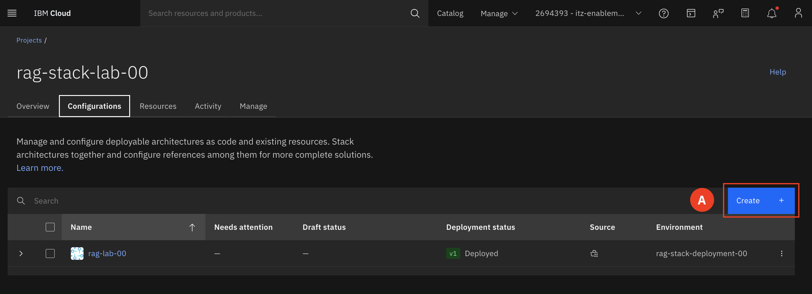
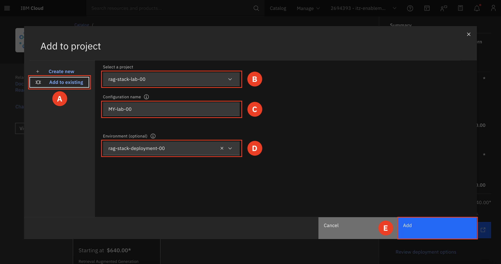

# Deploy MY-lab Stack 

In this section, participants will first deploy their own deployable architecture (DA) within IBM Cloud.
______

Retrieval augmented generation (RAG) is an AI framework for improving the quality of LLM-generated responses by grounding the model on external sources knowledge to supplement the LLM’s internal representation of information.

1. Expand the **Navigation menu (A)** on the upper right-hand corner. Select **Projects (B)**

     **Projects** are a named collection of configurations used to manage resources and deployments across accounts, employing an Infrastructure as Code (IaC) approach. Projects allow teams to configure, deploy, and monitor deployments using DevOps best practices. Each project includes tools to scan for potentially harmful resource changes, ensure compliance, track security, and manage costs. They are designed with a compliance-first and IaC approach to guarantee that projects are secure, governed, and continuously compliant.

2. Select the **deployed project (A)** that corresponds to your group number.

3. Switch to the **Configurations tab (A)**

4. Click **Create (A)**

5. You will be redirected to the Catalog, make sure you are on the **Community registry (A).**

6. Find and select the **Retrieval Augmented Generation Pattern**  

Scroll down and take a minute to review the **Architecture Overview** tab. This will give you an even deeper understanding of what is deployed.

7. Click **Add to Project (A)**  

8. Configure the DA  

    a. Make sure you are on **Add to existing (A)**  

    b. Make sure the **Select a project** matches your group number. **(B)**

    c. Change the Configuration name to **MY-lab-## (C)**, where the ## is replaced with your group number.   
    For example: MY-lab-00
  
    d. Make sure the **environment (D)** corresponds to your group number. 
    
    e. Click **Add (E)**  

9. You will now need to update the prefix for your stack. Scroll down until you find the required section and select it. 
    
    You will need to update the prefix section (<ins>use all lowercase for the prefix</ins>) to my-lab-##, where ## is replaced with your group number. 

    Click the save button. You will now click "Validate". Once the popup window appears you can click out of it. Your project will now start to build. 
    
    ADD SCREENSHOT

___

Congratulations, you have just deployed your own DA! For the remainder sections of the lab you will be viewing resources that were deployed by an already deployed stack and is ready for you to explore. This will provide valuable insight into how these resources integrate to form a secure and compliant generative AI (Gen AI) solution.