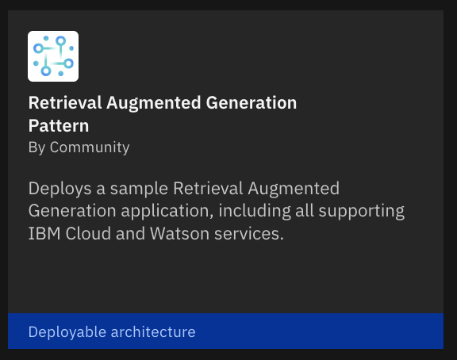
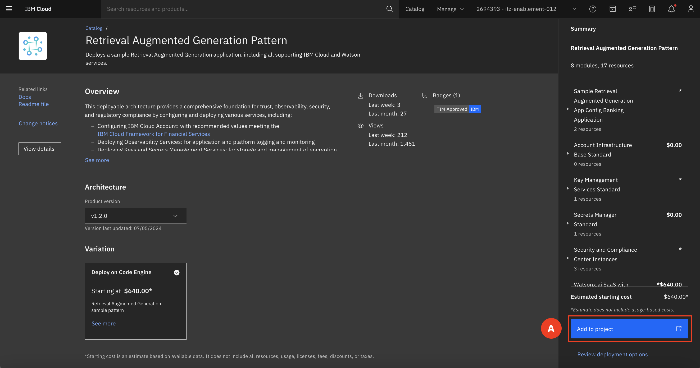
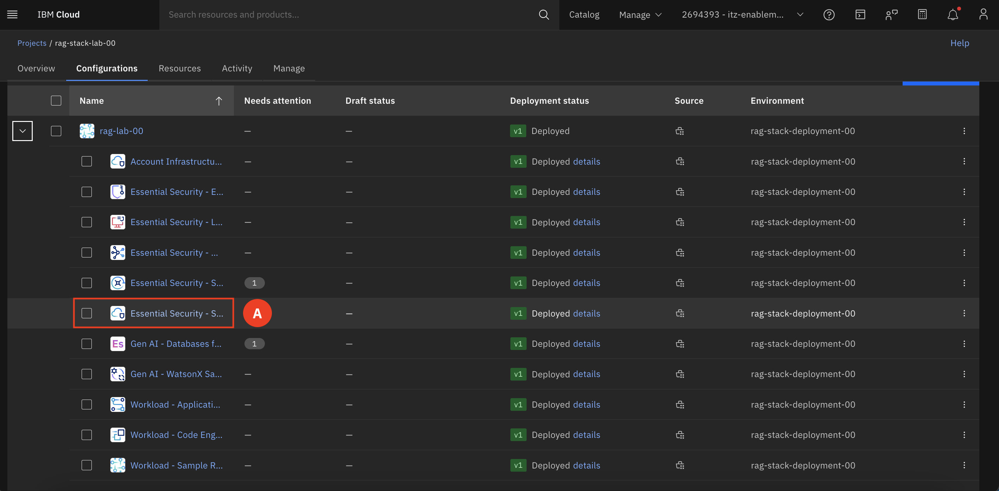

# Deploy the Stack 

In the first half of the lab, participants will first deploy their own deployable architecture (DA) within IBM Cloud. After the deployment, they will examine the various cloud resources that have been provisioned by a previously deployed DA, gaining an understanding of the components and services that make up the deployed architecture. This will provide valuable insight into how these resources integrate to form a secure and compliant generative AI (Gen AI) solution.
______

Retrieval augmented generation (RAG) is an AI framework for improving the quality of LLM-generated responses by grounding the model on external sources knowledge to supplement the LLM’s internal representation of information.

1. Expand the **Navigation menu (A)** on the upper right-hand corner. Select **Projects (B)**

    **Projects** are a named collection of configurations used to manage resources and deployments across accounts, employing an Infrastructure as Code (IaC) approach. Projects allow teams to configure, deploy, and monitor deployments using DevOps best practices. Each project includes tools to scan for potentially harmful resource changes, ensure compliance, track security, and manage costs. They are designed with a compliance-first and IaC approach to guarantee that projects are secure, governed, and continuously compliant.

2. Select the **deployed project (A)** that corresponds to your group number. 

3. Switch to the **Configurations tab (A)**

4. Click **Create (A)**

5. You will be redirected to the Catalog, make sure you are on the **Community registry (A).**

6. Find and select the **Retrieval Augmented Generation Pattern**  

Scroll down and take a minute to review the **Architecture Overview** tab. This will give you an even deeper understanding of what is deployed.

7. Click **Add to Project (A)**  

8. Configure the DA  
    a. Make sure you are on **Add to existing (A)**  

    b. Make sure the **Select a project** matches your group number. **(B)**

    c. Change the Configuration name to **MY-lab-# (C)**, where the # is replaced with your group number. For example: MY-lab-00
  
    d. Make sure the **environment (D)** corresponds to your group number  
    
    e. Click **Add (E)**  

9. Ready to validate? 

10. View the already deployed project.

    a. Find the Security Compliance Center v1 and select **Deployed details (A)** 
        

    b. Select the arrow **(A)** to expand the Validation successful section. Click the green number that indicates the number of resources created to view the resources. 
    

    c. Here is a list of created resources by that specific section of the DA. 
    

    Repeat the same steps for the **Sample RAG App Configurations** section of the DA. 

11. Expand the **Navigation menu (A)** on the upper right-hand corner. Select **Resource list.**  Filter for your resource group under **Group (B)** to view all resource deployed by the DA.

## Deployment Architecture Overview

This Deployable Architecture provides a robust, flexible, and secure framework for deploying RAG-based AI applications. It leverages the power of serverless technologies, advanced AI and data platforms, integrated DevSecOps practices, and stringent security and compliance measures to deliver an efficient deployment solution. The ability to customize and rapidly deploy the architecture within hours makes it an asset for any organization looking to implement AI-driven solutions. Below is a high-level view of the DA and what is deployed.

### Expanded Overview of the DA

Serverless Services
* **Function-as-a-Service (FaaS):** Use Code Engine to run backend code without managing servers.

DevSecOps
* **CI/CD:** Automate build, test, and deployment phases with Toolchains.
* **Infrastructure as Code (IaC):** Manage infrastructure using Terraform.
* **Security Integration:** Ensure security across the DevOps lifecycle with ALM.

AI and Data Platform
* **Watson Machine Learning:** Develop, train, and deploy machine learning models.
* **Watson Discovery:** Analyze large volumes of structured and unstructured data with AI.
* **Watson Studio:** Prepare data, develop models, and deploy them in an integrated environment.
* **watsonx.governance:** Ensure AI deployments are compliant and transparent.
* **watsonx.ai:** Simplify AI model creation, training, and deployment.
* **watsonx Assistant:** Integrate AI-powered virtual assistants into applications.

Security and Compliance
* **Encryption and Key Management:** Secure data with Key Protect and Secret Manager.
* **Compliance and Monitoring:** Use Activity Tracker, Logging, Monitoring, and SCC for compliance and monitoring.
