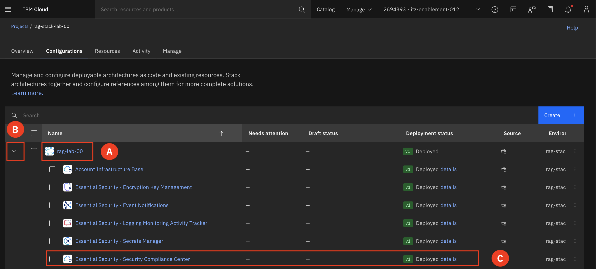
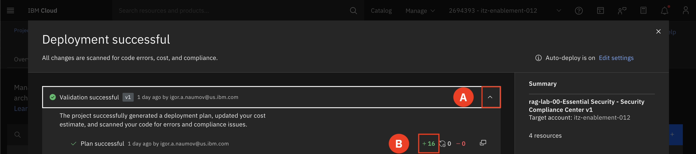
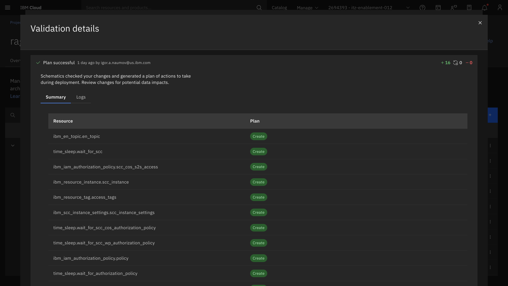
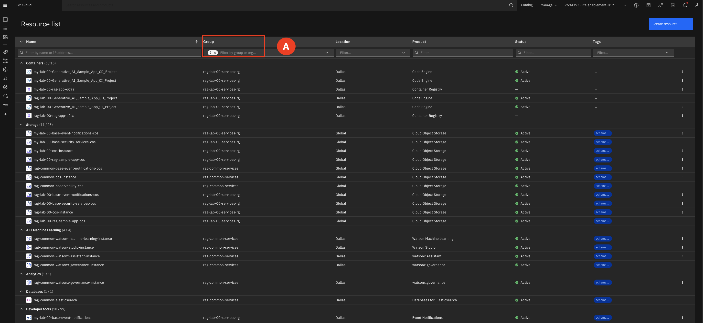
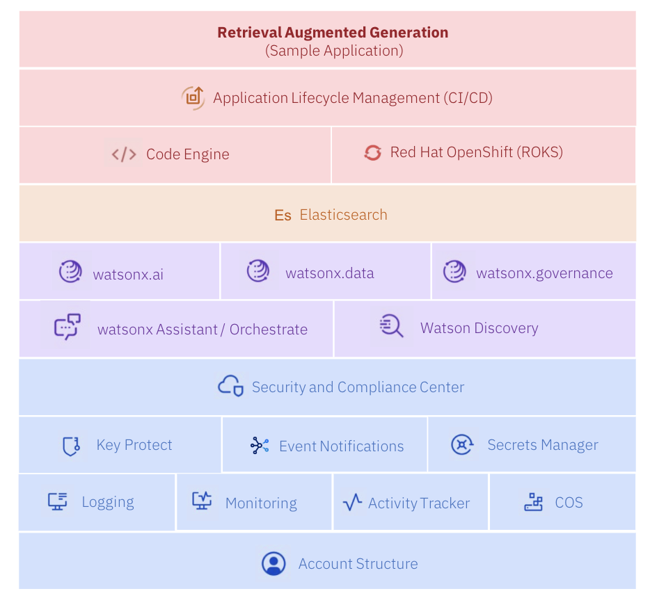

# View Pre-deployed Project

In this section we will be viewing the already deployed stack. We will take a closer look at a couple different layers of the stack to gain a better understanding of what is being created at that layer of the DA. 

---

1. In the Projects view, inside your rag-stack-lab-## that corresponds to your group number **(A)**.   
For example: rag-lab-00

    Click the **arrow (B)** to expand the list of components. You are able to expand the colum size so you are able to see the full name of the components. Find the **Essential Security - Security Compliance Center** and select **Deployed details (C)**.  
    

    b. Select the arrow **(A)** to expand the Validation successful section. Click the green number that indicates the number of resources created to view the resources **(B)**. 
    

    c. Here is a list of created resources by that specific section of the DA. 
    

    The following two items are created in the **Essential Security - Security Compliance Center** section of the DA:

    - **COS Instance (ibm_resource_instance.cos_instance):** An IBM Cloud Object Storage (COS) instance provides scalable and secure storage for data in the cloud.
  
    - **COS Bucket (ibm_cos_bucket.cos_bucket):** A COS bucket is a logical container within a COS instance where data is stored.

    Repeat the same steps for the **Workload - Sample RAG App Configurations** section of the DA. Use the breadcrumbs at the top left to navigate back to the project. 

2. Now let's look at the list of resources that have been created by the DA.  
    
    Expand the **Navigation menu (A)** on the upper right-hand corner. Select **Resource list (B)** from the Navigation menu.  

    Filter for your resource group (for example: rag-lab-00-service-rg) and **rag-common-services** under **Group (A)** to view all resources deployed by the DA.   

    You may have resources with a starting name of MY-lab, these are the resources that are currently being created by the DA you deployed at the beginning of the lab. 

## Deployment Architecture Overview

This Deployable Architecture provides a robust, flexible, and secure framework for deploying RAG-based AI applications. It leverages the power of serverless technologies, advanced AI and data platforms, integrated DevSecOps practices, and stringent security and compliance measures to deliver an efficient deployment solution. The ability to customize and rapidly deploy the architecture within hours makes it an asset for any organization looking to implement AI-driven solutions. Below is a high-level view of the DA and what is deployed.

### Expanded Overview of the DA

Serverless Services
* **Function-as-a-Service (FaaS):** Use Code Engine to run backend code without managing servers.

DevSecOps
* **CI/CD:** Automate build, test, and deployment phases with Toolchains.
* **Infrastructure as Code (IaC):** Manage infrastructure using Terraform.
* **Security Integration:** Ensure security across the DevOps lifecycle with ALM.

AI and Data Platform
* **Watson Machine Learning:** Develop, train, and deploy machine learning models.
* **Watson Discovery:** Analyze large volumes of structured and unstructured data with AI.
* **Watson Studio:** Prepare data, develop models, and deploy them in an integrated environment.
* **watsonx.governance:** Ensure AI deployments are compliant and transparent.
* **watsonx.ai:** Simplify AI model creation, training, and deployment.
* **watsonx Assistant:** Integrate AI-powered virtual assistants into applications.

Security and Compliance
* **Encryption and Key Management:** Secure data with Key Protect and Secret Manager.
* **Compliance and Monitoring:** Use Logging, Monitoring, and SCC for compliance and monitoring.

