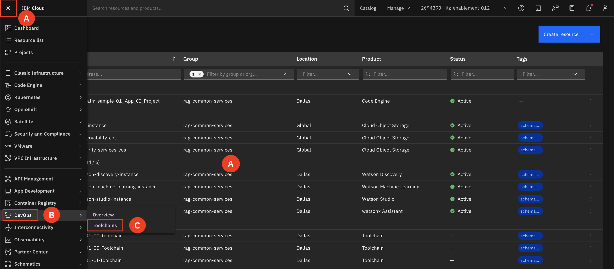
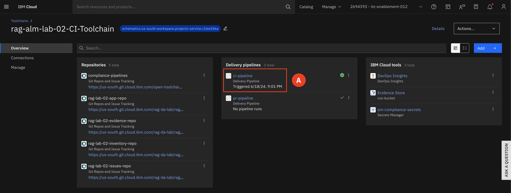
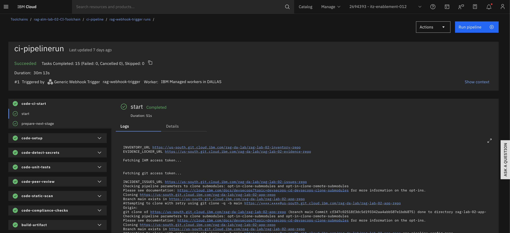

# Toolchains

At the Generative application layer, we need to make sure that we follow DevSecOps best practices to develop, test and deploy the Gen AI application on a secure infrastructure.

The Deployable Architecture Stack for the RAG Application includes DevSecOps for Application which is supported through IBM Cloud Toolchain Service the CI/CD/CC pipelines were used to deploy the application on Code Engine Services checking for vulnerabilities and ensuring audit-ability.

The (CI) pipeline is used to develop the application, using DevSecOps best practices including evidence collection, artifact signing, and vulnerability checks.

The (CD) pipeline supports continuous deployment of the application, including evidence collection, GitOps flow, change management, and compliance scans. Once deployed on Code Engine, we can launch the application and make it available for end users.

1. Expand the **Navigation menu (A)** and select **DevOps (B) > Toolchains (C)**

2. Make sure you are on the right **Resource Group (A)** that corresponds to your group number and select **Dallas for the Location (B).** Select the **rag-lab-##-CI-Toolchain (C)**, where ## is replaced with your group number. 

3. Select the **ci-pipeline (A)**

4. Select the **webhook-trigger (A)**

5. Select the most recent successful pipeline run

6. Review the steps of the CI pipeline. 
