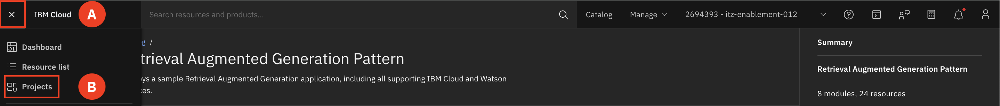
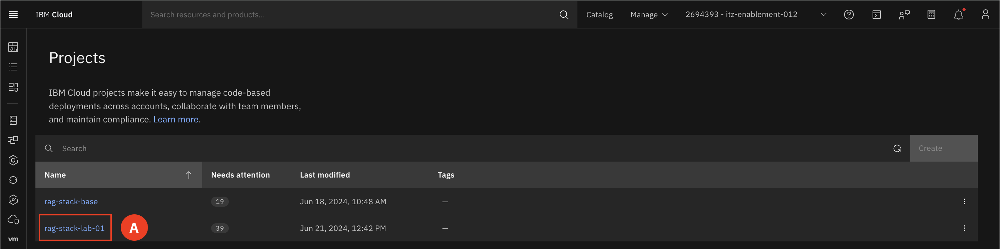
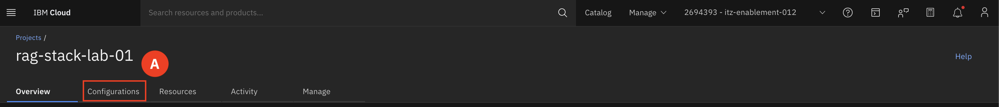
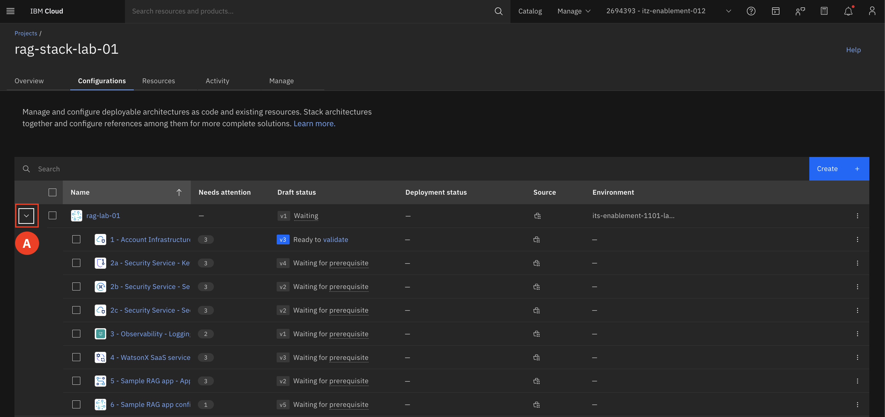

# View Deployed Project

1. Expand the **Navigation menu (A)** on the upper right-hand corner. Select **Projects (B)**

2. Select the **deployed project (A)**

3. Switch to the **Configurations tab (A)**

4. Expand the project to view all the deployments.

5.	Expand the **Navigation menu (A)** on the upper right-hand corner. Select **Resource list.**  Filter for your resource group under **Group (B)** to view all resource deployed by the DA.

