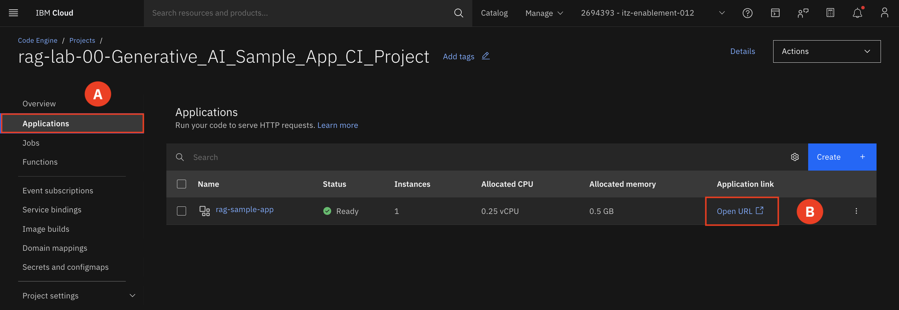
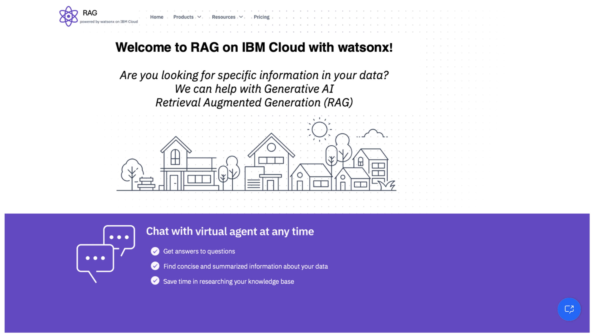

# Launch Sample Application

We have a Generative AI application running on IBM Cloud that was developed using watsonx capabilities. It offers a chatbot that can answer inquiries regarding bank loans for potential customers. The chatbot employs a Retrieval Augmented Generation (RAG) pattern, in which the bank's loan documentation and policies serve as the knowledge base to augment the Gen AI. 

Let's see the RAG Pattern Gen AI application in action: Assume you're a prospective consumer searching for a loan. You visit a bank's website and begin asking queries to the virtual agent. Using the bank's own data and the generative AI foundation model, the virtual agent generates solutions based on the inquiry, whether it's a general topic or trying to identify a specific loan product.
___

1. Switch to the **Applications (A)** tab and select **Open URL (B)** to launch the application. Leave this new tab open, we will be revisiting the chatbot throughout the remainder of the lab. 

2. Open the virtual agent chat window in the bottom right-hand corner **(A)**.

3. Ask the virtual assistant questions. Here are some example questions to get you started.
* What is a conventional loan?
* What is arm?
* Is arm a good choice?
* What loan should I get for an expensive property?
* How much does it cost to get a bank loan?

