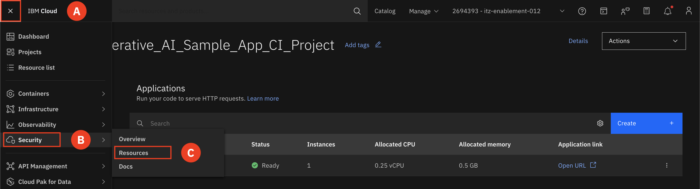
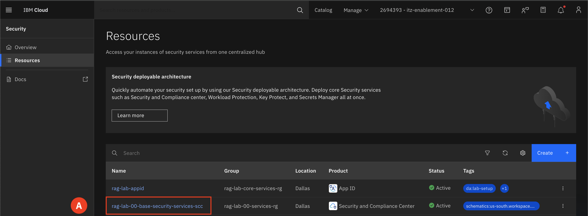
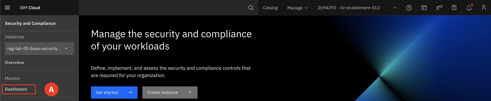
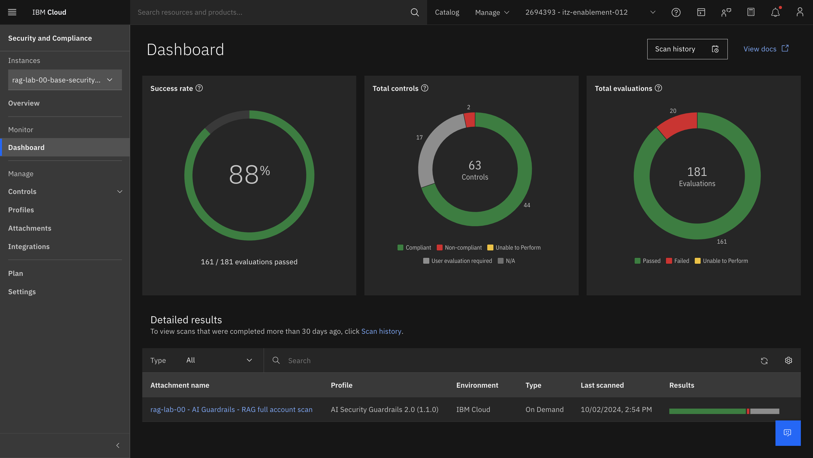
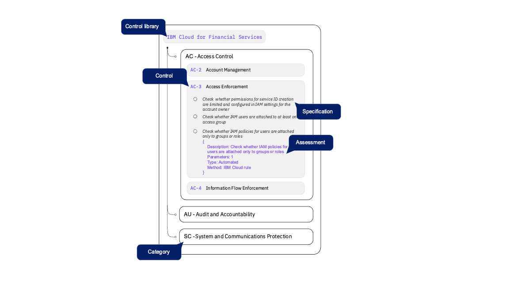
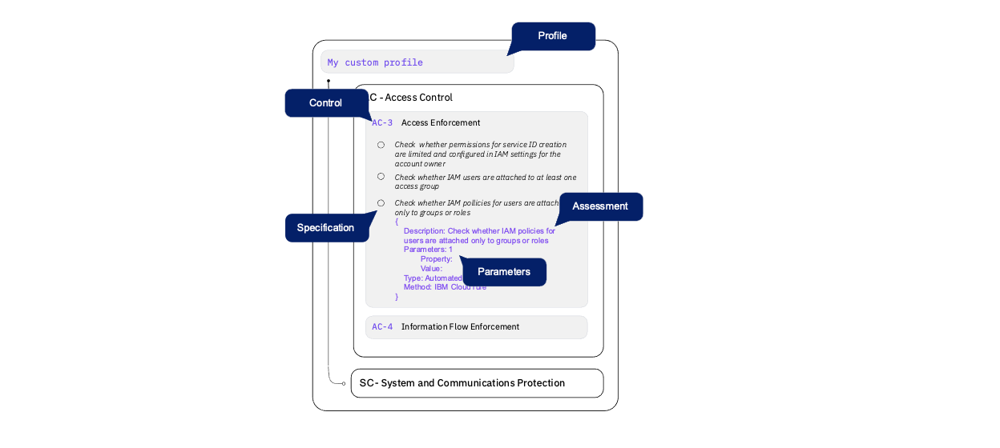

# Security and Compliance Center (SCC)

The Security and Compliance Center (SCC) enforces policies through code, deploys secure data and workload controls, and evaluates security and compliance posture. This is supported by two distinct profiles: the IBM Cloud Framework for Financial Services and AI ICT Guardrails. These profiles contain controls that ensure compliance with industry-specific or regulatory requirements, enhancing the overall security and compliance framework.

---

1. Expand the **Navigation menu (A)** and then hover over **Security (B)** and select **Resources (C).**

2. Select the resource **rag-lab-##-base-security-services-scc (A)** (where ## is replaced with your group number).  
For example: rag-lab-00-base-security-services-scc

3. Select **Dashboard (A)**

## SCC Scans

Upon entering the dashboard, you're presented with three graphical representations of your scan data.
* The Overview tab showcases your success rate and any drift in results over your chosen time frame.
* The Controls tab provides a concise overview of each control's compliance status at the time of scanning.
* The Resources tab offers detailed results for each specific resource evaluated.

This streamlined approach to managing and analyzing your scan data enables you to make informed decisions to enhance the security and compliance of your environment with SCC.

### Controls and Control libraries   
**Controls**
A technical, administrative, or physical safeguard that is designed to meet a set of defined security and privacy requirements. Controls exist to prevent, detect, or lessen the ability of a threat to exploit a vulnerability.

**Control libraries**  
A collection of predefined or custom controls. Control libraries show all the controls in your accounts that are available to be evaluated. A library is helpful for organizing and versioning of your controls. A library is structured as follows.

**Profiles**  
A profile is a group of controls that are related to a specific compliance objective.

Although very similar in structure to a control library, a profile can be attached to a set of resources and be evaluated. When you create the attachment, you can set the parameters that define the way the evaluation is done.

