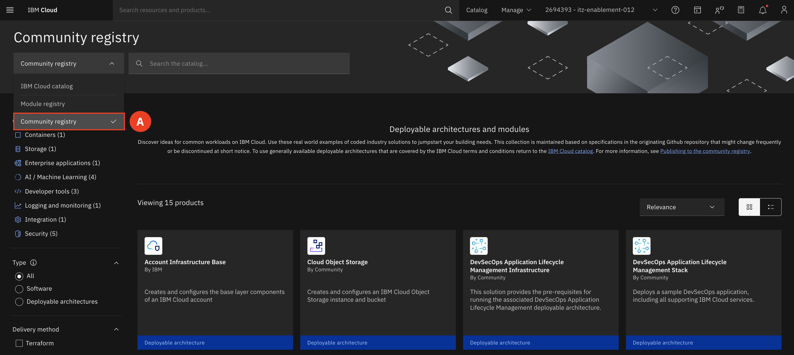

# Navigate to the RAG Pattern Title

In the first half of the lab, participants will examine the various cloud resources that have been deployed by the DA. This will include identifying and understanding the components and services that make up the deployed architecture, providing insight into how these resources integrate to form a secure and compliant generative AI (Gen AI) solution.

______

Retrieval augmented generation (RAG) is an AI framework for improving the quality of LLM-generated responses by grounding the model on external sources knowledge to supplement the LLM’s internal representation of information.

1.	On the Dashboard of the Cloud account, first **make sure you are on the right account (A).** When ready, select **Catalog (B).**

2.	Switch to the **Community registry (A).**

3.	Find and select the **Retrieval Augmented Generation Pattern** 

Scroll down and take a minute to review the **Architecture Overview** tab. This will give you an even deeper understanding of what is deployed.

## Deployment Architecture Overview

This Deployable Architecture provides a robust, flexible, and secure framework for deploying RAG-based AI applications. It leverages the power of serverless technologies, advanced AI and data platforms, integrated DevSecOps practices, and stringent security and compliance measures to deliver an efficient deployment solution. The ability to customize and rapidly deploy the architecture within hours makes it an asset for any organization looking to implement AI-driven solutions. Below is a high-level view of the DA and what is deployed.

### Expanded Overview of the DA

Serverless Services
* **Function-as-a-Service (FaaS):** Use Code Engine to run backend code without managing servers.

DevSecOps
* **CI/CD:** Automate build, test, and deployment phases with Toolchains.
* **Infrastructure as Code (IaC):** Manage infrastructure using Terraform.
* **Security Integration:** Ensure security across the DevOps lifecycle with ALM.

AI and Data Platform
* **Watson Machine Learning:** Develop, train, and deploy machine learning models.
* **Watson Discovery:** Analyze large volumes of structured and unstructured data with AI.
* **Watson Studio:** Prepare data, develop models, and deploy them in an integrated environment.
* **watsonx.governance:** Ensure AI deployments are compliant and transparent.
* **watsonx.ai:** Simplify AI model creation, training, and deployment.
* **watsonx Assistant:** Integrate AI-powered virtual assistants into applications.

Security and Compliance
* **Encryption and Key Management:** Secure data with Key Protect and Secret Manager.
* **Compliance and Monitoring:** Use Activity Tracker, Logging, Monitoring, and SCC for compliance and monitoring.
