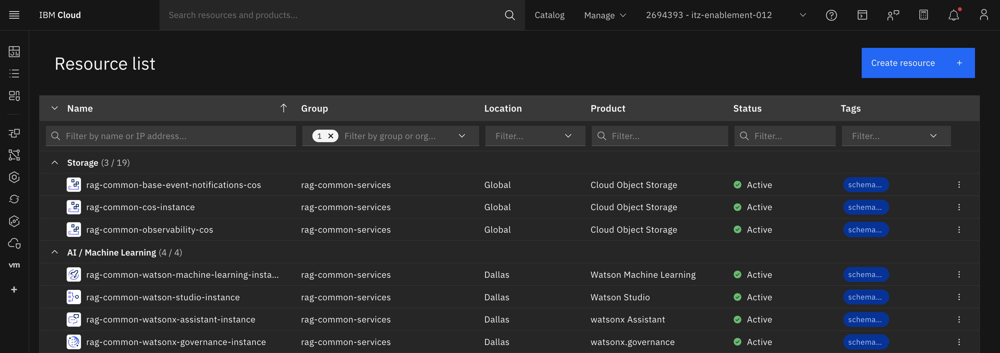
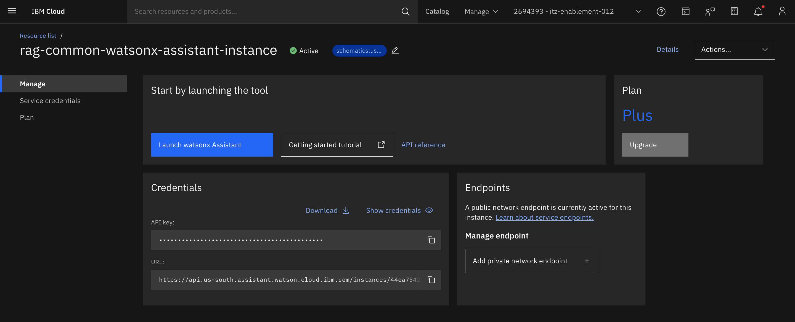
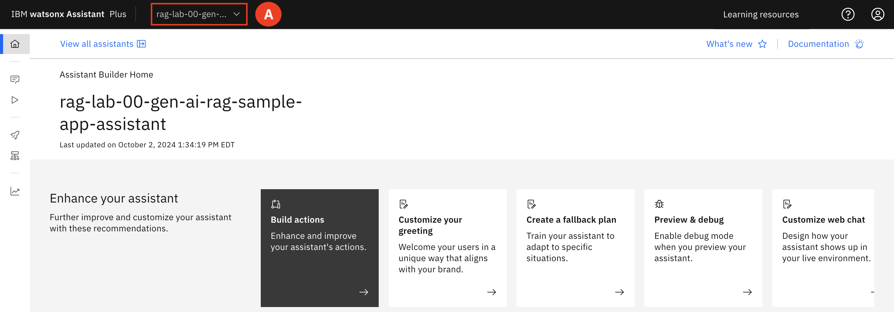
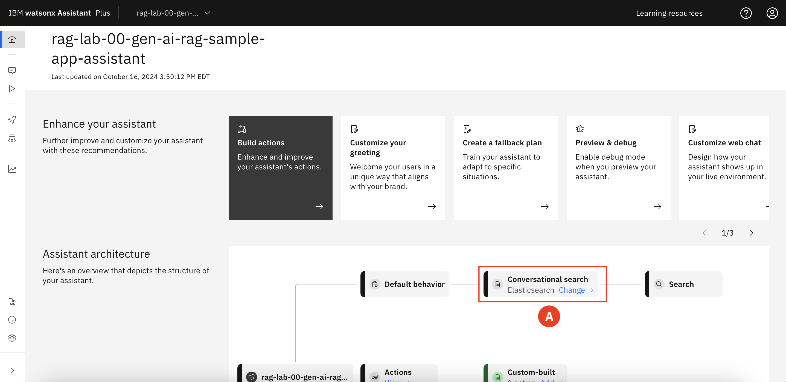
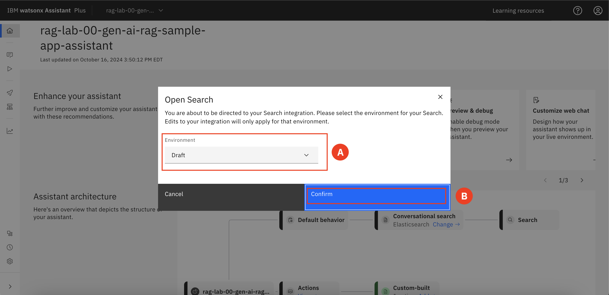
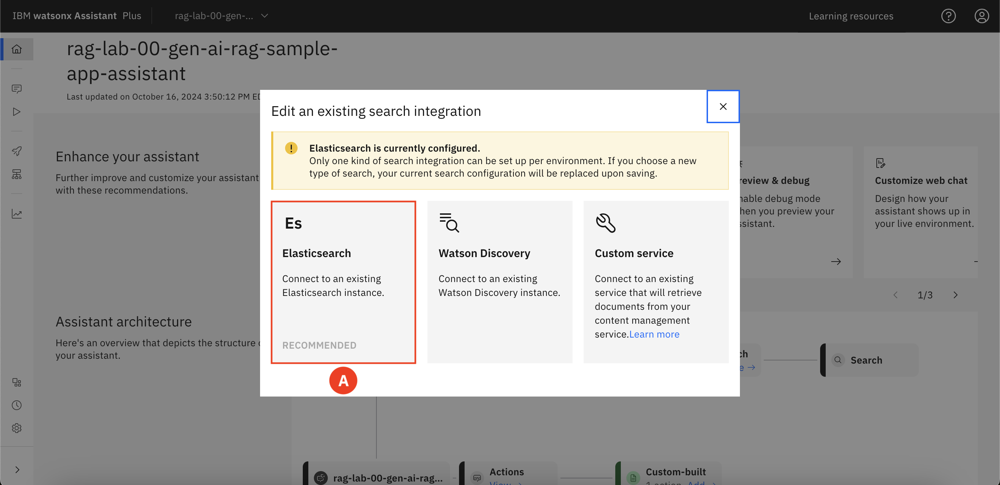
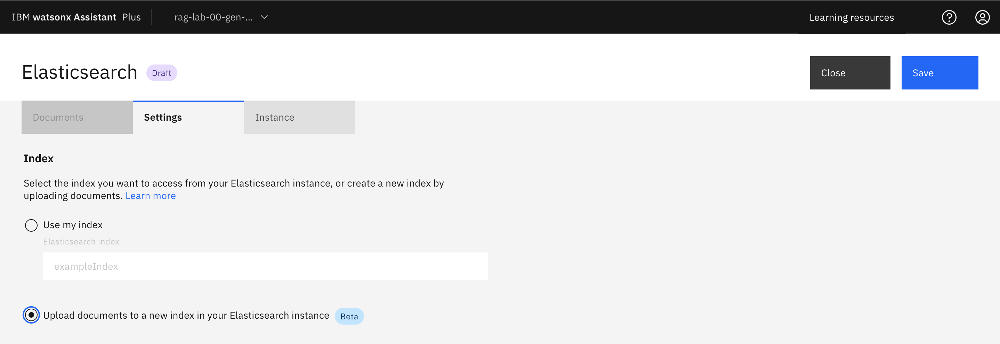
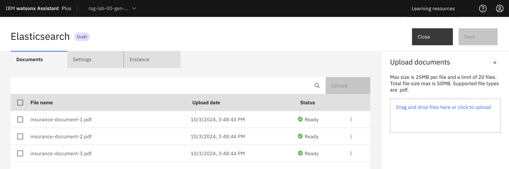

# Upload New Artifacts

1. Expand the **Navigation menu (A)** and filter for **rag-common-services under Group (B)**.   

    Expand the **AI / Machine Learning (C)** section of the resource list.   

    Select the **rag-common-watsonx-assistant-instance (D)**

2. Select **Launch Assistant (A)** 

3. Check that you are on the correct project that corresponds to your group number. 

4. Under **Assistant architecture**, find **Conversational search** and select **Change (A)**

5. For the environment select **Draft (A)** and then click **Confirm (B)**

6. Select **Elasticsearch (A)**

7. On the **Settings tab (A)** select ***Upload documents to a new index in your Elasticsearch index (B)***. Click **Save (C)**.

8. Select the **Documents tab (A)** and you should see 5 new files that are related to life insurance.   

9. You will need to re-launch the chatbot so the changes that have been made to the documents are applied. 

 Ask the questions again regarding life insurance and observe the improvement in answers. 
 
* What are the different life insurance policies?
* When should I buy life insurance? 
* What does life insurance cover

___
Congratulations, you just learned how to integrate new documents into the chatbot, enabling the chatbot to utilize these documents for more accurate and contextually relevant responses.