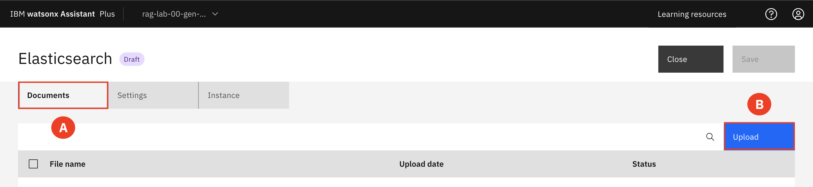

# Upload New Artifacts

1. Expand the **Navigation menu (A)** and filter for **rag-common-services under Group (B)**.   

    Expand the **AI / Machine Learning (C)** section of the resource list.   

    Select the **rag-common-watsonx-assistant-instance (D)**

2. Select **Launch Assistant (A)** 

3. Check that you are on the correct project that corresponds to your group number. 

4. Under **Assistant architecture**, find **Conversational search** and select **Change (A)**

5. For the environment select **Draft (A)** and then click **Confirm (B)**

6. Select **Elasticsearch (A)**

7. On the **Settings tab (A)** select ***Upload documents to a new index in your Elasticsearch index (B)***. Click **Save (C)**.

-----

9. Follow this [**link**](https://github.com/IBM/gen-ai-rag-watsonx-sample-application/tree/main/artifacts/sample-data/life-insurance-faqs) to where you will be able to download a new set of PDFs to upload.   

Download the following PDF files:  

* life-insurance-faq-1.pdf
* life-insurance-faq-2.pdf
* life-insurance-faq-3.pdf
* life-insurance-faq-4.pdf
* life-insurance-faq-5.pdf

Select the file you want to download. Click on the **triple dot (A)** and then select **Download (B)**. 
Repeat for all 5 files. 

10. Select the **Documents tab (A)** and the click **Upload (B)** to upload the new PDFs.  

10. Once the new documents have been uploaded navigate back to the chatbot tab and ask the questions again and observe the improvement in answers. 
* What are the different life insurance policies?
* When should I buy life insurance? 
* What does life insurance cover

___
Congratulations, you just learned how to integrate new documents into the chatbot, enabling the chatbot to utilize these documents for more accurate and contextually relevant responses.