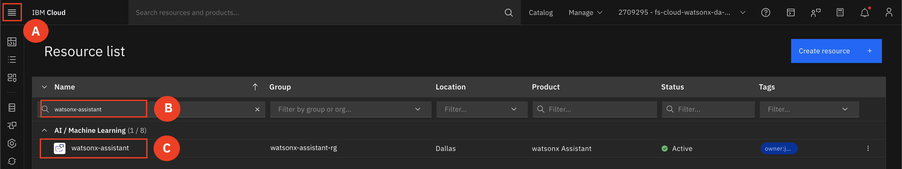
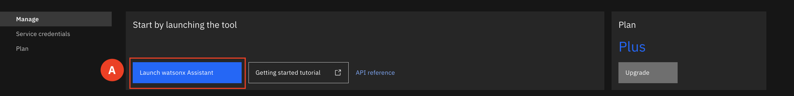
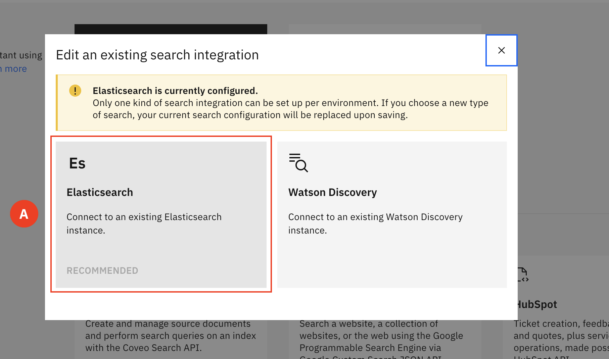

# Upload New Documents

1. Expand the **Navigation menu (A)** and type in the **watsonx assistant name (B)** and select the **instance (C)**

2. Select **Launch Assistant (A)** 

3. From the **drop menu (A)**, select the **project (B)**

4. On the left-hand side navigation menu, select **Integration (A)**

5. Scroll down till you find the **Extension** section, locate **Search** and select **Open (A)**

6. For the environment select **Draft (A)** and then click **Confirm (B)**

7. Select **Elasticsearch (A)**

8. Select the **Documents tab (A)** and the click **Upload (B)** to upload the new PDFs

9. Once the new documents have been uploaded navigate back to the chatbot and ask the questions again and observe the improvement in answers. 
* What are the different life insurance policies?
* When should I buy life insurance? 
* What does life insurance cover?
